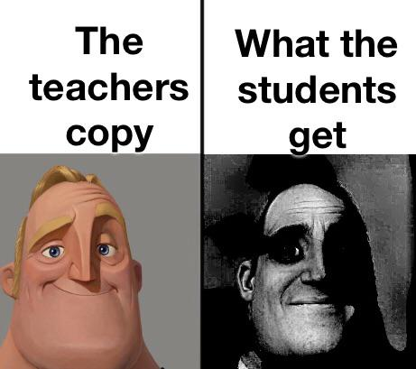

___

```{r setup, include=FALSE}
knitr::opts_chunk$set(echo=TRUE, message=FALSE, warning=FALSE, error=FALSE)
library(magick)
library(tidyverse)
```

```{css, echo = FALSE}
body {
  background-color: #d4eeff;
  margin-top: 30px;
  margin-bottom: 30px;
  font-family: Verdana;
}
#header {
  background-color: #056cb0;
  color: white;
  padding: 20px;
  text-align: center;
  border-style: solid;
  border-color: black;
  border-radius: 25px;
}
h2 {
  background-color: white;
  text-align: center;
  padding: 10px;
  border-style: solid;
  border-color: white;
  border-radius: 25px;
}
hr {
  border: 2px solid black;
}
```

## Introduction

This project was done as part of my undergraduate degree at the University of Auckland. The source code for this project as well as some other projects are available on my [GitHub](https://github.com/SWalles/STATS220).

## Project Goal

This project was an introduction to Markdown, R Markdown, and the [Magick](https://cran.r-project.org/web/packages/magick/index.html) R Package. The goal was to find an "inspiration" meme and then recreate it in R. Below is the meme I used as inspiration:



The meme consists of four panes. Two panes contain text and the other two contain an image of a happy man and the last pane contains a distorted image of the same man. I will rotate / shuffle the panes around so they can be read left to right, top to bottom. I will also change the text to something more statistics appropriate and add some images to go with the text. Instead of the images of a man I will use a kitten and use the image_negate() function to create a distorted version. I will also add borders to the frames so that they are nicer to present. 

## Results

```{r meme-code, eval=TRUE}
# Frame 1
frm1_words <- image_blank(width = 250, height = 50, color = "#91d2f2") %>% 
  image_annotate("Normal Distribution", gravity = "center", size = 20)

frm1_image <- image_read("https://www.scribbr.com/wp-content/uploads/2023/02/standard-normal-distribution-example.webp") %>% 
  image_scale("250x200")

frm1 <- c(frm1_words, frm1_image) %>% 
  image_append(stack = TRUE) %>% 
  image_extent("250x250", color = "#91d2f2") %>% 
  image_border(color = "black", geometry = "2x2")
  

# Frame 2
frm2_image <- image_read("https://i.ebayimg.com/images/g/jw4AAOSwvv1krzzl/s-l1200.webp") %>% 
  image_scale(geometry = "250x250")
frm2 <- frm2_image %>% 
  image_extent("250x250", color = "#91d2f2") %>% 
  image_border(color = "black", geometry = "2x2")


# Frame 3
frm3_words <- frm1_words

frm3_image <- image_read("https://www.investopedia.com/thmb/vEnFyFaX2zK96wVerxokPmEt3dU=/1500x0/filters:no_upscale():max_bytes(150000):strip_icc()/Clipboard01-fdb217713438416cadafc48a1e4e5ee4.jpg")  %>% 
  image_scale("250x200")

frm3 <- c(frm3_words, frm3_image) %>% 
  image_append(stack = TRUE) %>% 
  image_extent("250x250", color = "#91d2f2") %>% 
  image_border(color = "black", geometry = "2x2")


# Frame 4
frm4 <- frm2_image %>% 
  image_negate() %>% 
  image_extent("250x250", color = "#91d2f2") %>% 
  image_border(color = "black", geometry = "2x2")


# Assemble meme
meme_p1 <- c(frm1, frm2) %>% 
  image_append()

meme_p2 <- c(frm3, frm4) %>% 
  image_append()

meme <- c(meme_p1, meme_p2) %>% 
  image_append(stack = TRUE)

# View
meme

```

The magick package also allows me to create basic animations so below I included an animated version.

```{r animation-code, eval=FALSE}
# NB This chunk requires the frames from the previous chunk to function
# Animate meme
meme_animation <- c(frm1, frm2, frm3, frm4) %>% 
  image_scale(geometry = "250x250") %>% 
  image_animate(fps = 0.5)
image_write(meme_animation, path = "my_animation.gif", format = "gif")
```


## Reflection

I have finished a couple of other statistics courses that have required me to use R Markdown to do assignment so I had some basic markdown knowledge coming into this course. I have however enjoyed learning about markdown as a technology as well as some formal syntax regarding its use. Learning about how to embed links and images using markdown was a real highlight for me. 

I also feel that learning about css was very important as it will allow me to create documents that are less generic and have a unique and exciting presentation. This is important as it could allow for more effective communication of ideas.

I am excited to learn more about R packages. Up to now I have mainly been exposed only to base R. Learning about different packages and their applications, like "magick", would allow me more freedom while using R.

___